# ZeroPay

**Non-custodial programmable escrow and multi-chain settlement infrastructure for merchant commerce.**

ZeroPay coordinates payments by combining on-chain escrow scripts with off-chain transaction tracking. It decouples high-latency blockchain finality from client interactions, providing merchants with sub-second payment visibility, double-entry bookkeeping, and automated dispute resolution.

---

### Core Guarantees

*   **Non-Custodial Escrows**: Private keys never touch server memory. Transaction payloads are built by the API and signed client-side via wallet extensions (CIP-30 or EVM).
*   **Immutable Ledgering**: Every settlement, milestone release, or refund is posted to a balanced double-entry ledger database, verifying the conservation of asset value.
*   **Optimistic Sync**: Decouples blockchain block times from the checkout user experience by tracking mempool inputs and streaming updates to clients in under 500 milliseconds.
*   **Resilient Operations**: Uses circuit breakers and fallback RPC providers to maintain transaction tracking during network partitions.

---

### Supported Networks

*   **Cardano (Preprod Testnet)**: Native ADA settlement using Plutus V3 escrow scripts.
*   **Base L2**: Stablecoin (USDC) settlement using EVM escrow smart contracts.

---

## 1. System Topology

ZeroPay divides workloads between stateless HTTP/WebSocket gateway nodes and a decoupled cluster of background workers. They communicate asynchronously via Redis-backed message queues.

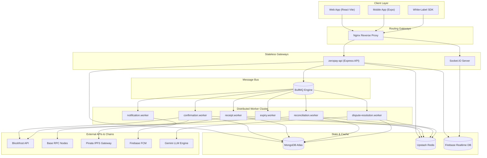

> **Architecture Invariant**: API gateway instances remain stateless. If a background worker node crashes during a blockchain confirmation loop, BullMQ flags the stalled task and reassigns it to an active worker.

---

## 2. Escrow & Settlement Lifecycle

On-chain validators enforce that funds locked in escrow cannot be released or refunded without valid multi-signature coordinates, milestone completion, or admin arbitration.

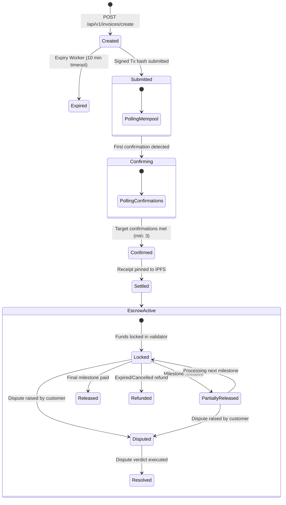

### Transaction Routing

This sequence outlines the steps from local transaction building to background block confirmation:

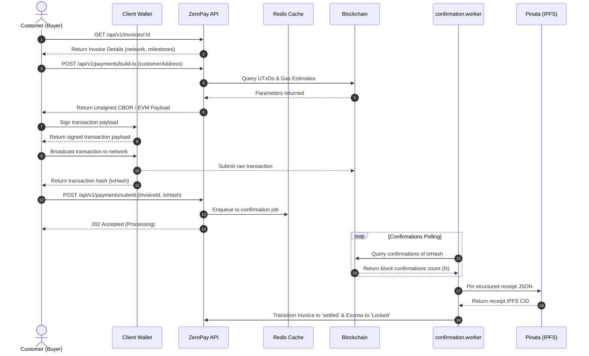

---

## 3. Double-Entry Bookkeeping Ledger

Every settlement event (escrow lock, milestone release, or refund) is recorded to a write-once ledger database. This system tracks assets in absolute integers using two denominations: `amountLovelace` (Cardano native) and `amountPaise` (fiat equivalent).

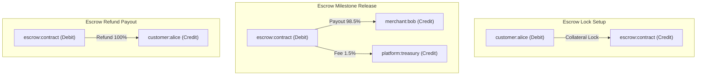

> **Ledger Invariant**: Ledger records are append-only. The database model validates before writing that debits equal credits exactly. To correct an entry, a matching reversal transaction must be posted.

---

## 4. Realtime Client Sync

ZeroPay uses a write-through pattern to update client interfaces. When workers confirm state changes, they update MongoDB and sync the new data to Firebase RTDB.

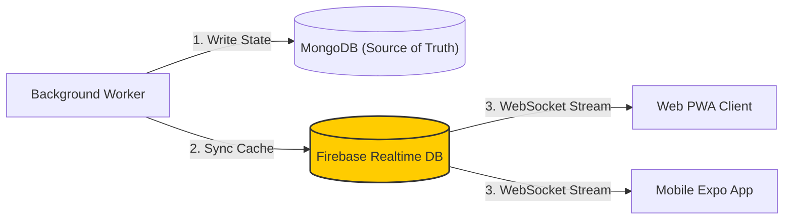

---

## 5. Multi-Chain Adapter Layer

Core settlement flows are decoupled from blockchain-specific APIs. Invoices specify their settlement network, and the router loads the corresponding adapter from the registry.

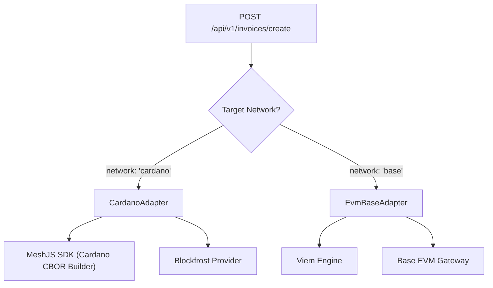

### The Chain Adapter Interface

```typescript
export interface IChainAdapter {
  chainName: string;
  nativeAssetSymbol: string;

  /** Build transaction payload parameters for locking funds in escrow */
  buildLockTx(
    invoiceId: string, 
    amount: number, 
    customerAddr: string
  ): Promise<{ txCbor?: string; txMetadata?: any; scriptAddress: string }>;

  /** Verify that a client transaction settled on the blockchain */
  verifyOnChainPayment(
    txHash: string, 
    expectedAddr: string, 
    expectedAmount: number
  ): Promise<PaymentVerificationResult>;

  /** Query the active escrow UTxO locked on-chain */
  findActiveEscrowUtxo(invoiceId: string): Promise<EscrowUtxoResult | null>;

  /** Construct transaction parameters to release milestone funds */
  buildReleaseTx(
    invoiceId: string, 
    milestoneIndex: number, 
    payoutAddr: string
  ): Promise<{ txCbor?: string; txMetadata?: any }>;

  /** Construct transaction parameters to refund all funds back to client */
  buildRefundTx(
    invoiceId: string, 
    refundAddr: string
  ): Promise<{ txCbor?: string; txMetadata?: any }>;

  /** Construct transaction parameters to resolve disputes with a custom payout split */
  buildResolveTx(
    invoiceId: string, 
    merchantPayout: number, 
    customerPayout: number
  ): Promise<{ txCbor?: string; txMetadata?: any }>;
}
```

---

## 6. AI Negotiation & Commerce Agents

Merchants can enable autonomous price negotiations within chat rooms. The negotiation agent uses the `gemini-3-flash-preview` model.

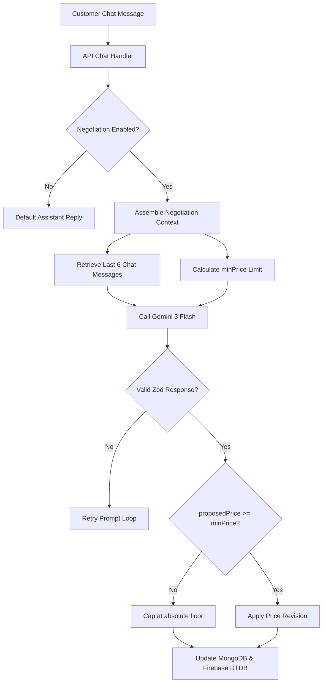

> **Pricing Guardrail**: The AI agent is bound by the merchant's configured maximum discount (`minDiscountPct`). The API server calculates and enforces the absolute price floor (`minPricePaise`) independently of the model's outputs.

---

## 7. Staked Juror Arbitration

If a buyer disputes an escrow transaction, the contract state is marked as `Disputed` on-chain, and ZeroPay initiates its arbitration protocol.

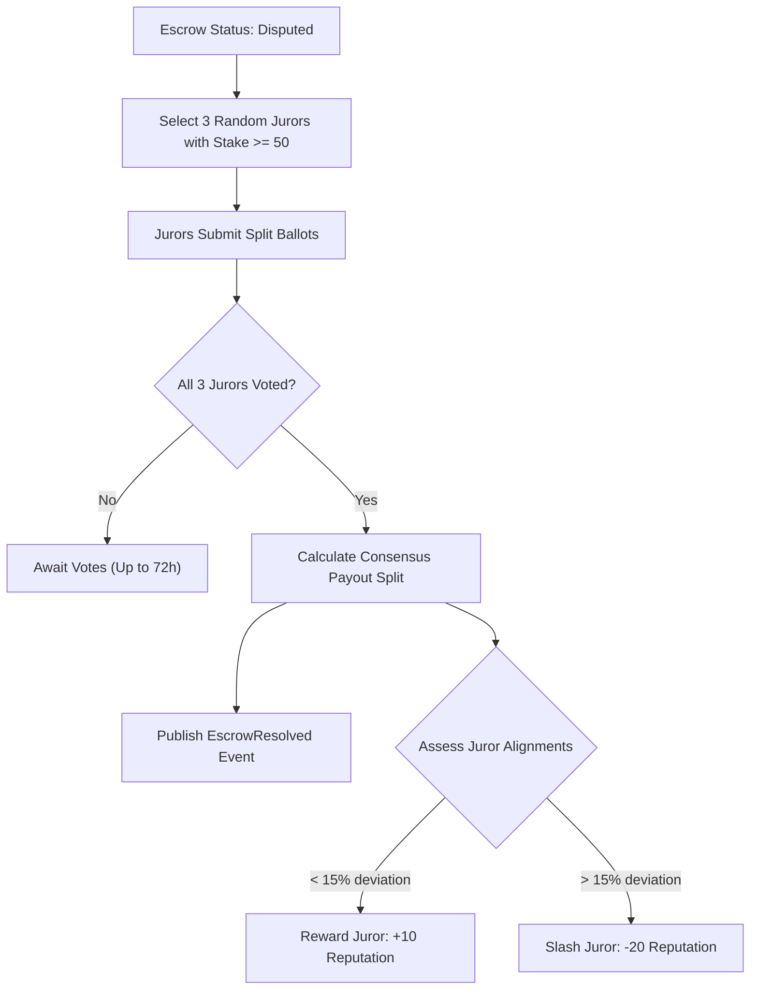

---

## 8. Asynchronous Processing & Webhooks

ZeroPay handles long-running jobs (confirmations, receipt generation, and webhook delivery) asynchronously using **BullMQ** running over **Upstash Redis**.

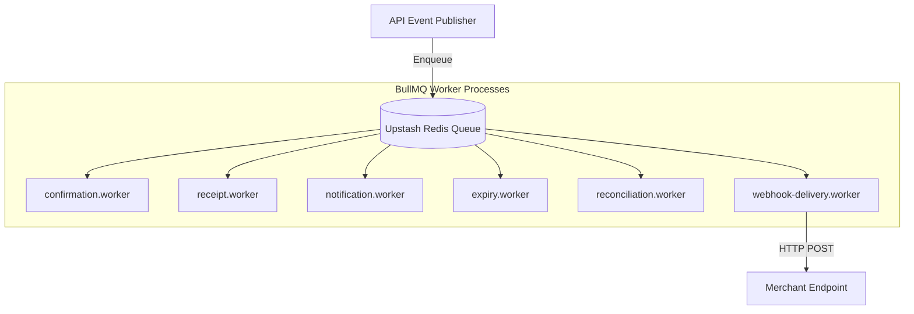

### Webhook Delivery Example

On milestone releases or refunds, the background delivery worker sends an HMAC-signed POST request to the merchant's configured endpoint:

```json
{
  "eventId": "evt_9b8c7d6e5f",
  "eventType": "escrow.locked",
  "merchantId": "mer_66509f61b8f2a4fb8c7d",
  "timestamp": "2026-05-25T04:05:22.187Z",
  "data": {
    "invoiceId": "INV-47F90B1E",
    "txHash": "a1b2c3d4e5f607a8b9c0d1e2f3a4b5c6d7e8f90a1b2c3d4e5f607a8b9c0d1e2f",
    "amountLovelace": 45000000,
    "customerAddress": "addr_test1qrr2cldldltxp372a0bc9e14a8b9c0d1e2f3a4b5c6",
    "status": "confirmed",
    "escrowState": "Locked"
  }
}
```

```typescript
import crypto from 'crypto';

/** Verify incoming webhook signature using the merchant client secret */
export function verifyWebhookSignature(
  rawBody: string, 
  signatureHeader: string, 
  webhookSecret: string
): boolean {
  const hmac = crypto.createHmac('sha256', webhookSecret);
  const calculatedSignature = hmac.update(rawBody).digest('hex');
  return crypto.timingSafeEqual(
    Buffer.from(calculatedSignature), 
    Buffer.from(signatureHeader)
  );
}
```

---

## 9. Resilience & Monitoring

### A. Circuit Breakers

Integration endpoints for external dependencies (Blockfrost, Base RPC, Pinata IPFS) are wrapped in **Circuit Breakers** to handle network partitions gracefully:

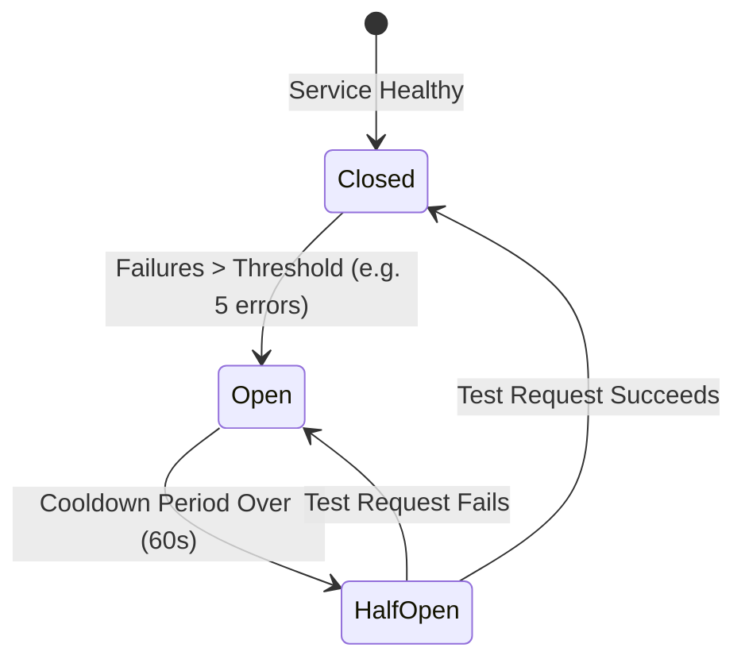

*   **Closed State**: Normal operations. Calls are sent to the external service.
*   **Open State**: Requests fail fast locally, protecting system resources.
*   **Half-Open State**: A single request is sent to check if the external service has recovered.

---

### B. SLA Alerting Configurations

Custom Prometheus configuration rules used to monitor system latency and ledger status:

```yaml
groups:
  - name: zeropay_alerts
    rules:
      - alert: HighQueueLatency
        expr: zeropay_queue_delay_seconds_bucket{le="30"} < 0.95
        for: 5m
        labels:
          severity: critical
        annotations:
          summary: Queue latency exceeds SLO target of 95% processing under 30s.

      - alert: LedgerImbalanceDetected
        expr: zeropay_ledger_verification_failures_total > 0
        for: 1m
        labels:
          severity: critical
        annotations:
          summary: Double-entry ledger verification failure. Value conservation violated.
```

---

## 10. Deployment & Infrastructure

### Containerization Stack

The production setup uses Nginx as a reverse proxy, routing requests to load-balanced API servers, workers, and databases:

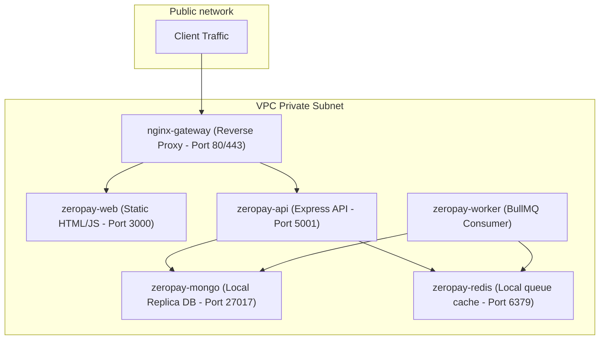

---

### Docker Compose Configuration

Use this `compose.yaml` file to deploy the ZeroPay stack:

```yaml
version: '3.8'

services:
  zeropay-mongo:
    image: mongo:7.0
    container_name: zeropay-mongo
    restart: unless-stopped
    ports:
      - "27017:27017"
    volumes:
      - mongo_data:/data/db
    environment:
      MONGO_INITDB_DATABASE: zeropay
    healthcheck:
      test: ["CMD", "mongosh", "--eval", "db.adminCommand('ping')"]
      interval: 10s
      timeout: 5s
      retries: 5

  zeropay-redis:
    image: redis:7.2-alpine
    container_name: zeropay-redis
    restart: unless-stopped
    ports:
      - "6379:6379"
    command: redis-server --appendonly yes --appendfsync everysec
    volumes:
      - redis_data:/data
    healthcheck:
      test: ["CMD", "redis-cli", "ping"]
      interval: 10s
      timeout: 5s
      retries: 5

  zeropay-api:
    build:
      context: .
      dockerfile: backend/Dockerfile
    container_name: zeropay-api
    restart: unless-stopped
    ports:
      - "5001:5001"
    env_file:
      - backend/.env
    environment:
      NODE_ENV: production
      PORT: 5001
    depends_on:
      mongodb:
        condition: service_healthy
      redis:
        condition: service_healthy
    healthcheck:
      test: ["CMD", "wget", "-qO-", "http://localhost:5001/health"]
      interval: 15s
      timeout: 8s
      retries: 5

  zeropay-worker:
    build:
      context: .
      dockerfile: backend/Dockerfile
    container_name: zeropay-worker
    restart: unless-stopped
    command: ["node", "dist/worker.js"]
    env_file:
      - backend/.env
    environment:
      NODE_ENV: production
    depends_on:
      mongodb:
        condition: service_healthy
      redis:
        condition: service_healthy

  zeropay-web:
    image: nginx:stable-alpine
    container_name: zeropay-web
    restart: unless-stopped
    ports:
      - "3000:80"
    volumes:
      - ./apps/web/dist:/usr/share/nginx/html
      - ./nginx.conf:/etc/nginx/nginx.conf
    depends_on:
      - zeropay-api

volumes:
  mongo_data:
  redis_data:
```

---

## 11. Local Development Setup

### 1. Prerequisites
*   Node.js >= 20.0.0
*   npm >= 9.0.0
*   A running MongoDB database and Redis instance

### 2. Setup
Clone the repository and install dependencies:
```bash
git clone https://github.com/your-org/zeropay.git
cd zeropay
npm install
```

Configure environment files:
```bash
# Copy backend variables
cp backend/.env.example backend/.env

# Copy web variables
cp apps/web/.env.example apps/web/.env.local
```

### 3. Run Development Servers
```bash
npm run dev
```
*   The REST API starts at: `http://localhost:4000`
*   The Vite Web App starts at: `http://localhost:5173`

---

## 12. Runbooks

---

### Incident: Redis Connection Failure

**Symptoms**: BullMQ workers stop processing tasks, and the UI displays Redis connectivity errors.

```bash
# 1. Verify connection to the Redis service
docker compose exec zeropay-redis redis-cli ping

# 2. Check container logs for connection errors
docker compose logs zeropay-redis --tail=100

# 3. Restart the Redis container if it is unresponsive
docker compose restart zeropay-redis
```

---

### Incident: Escrow Settlement Stalled

**Symptoms**: An invoice has been paid on-chain, but the database state remains stuck in the `confirming` state.

```bash
# 1. Query the on-chain UTxO data using the Blockfrost API
curl -H "project_id: $BLOCKFROST_PROJECT_ID" \
  https://cardano-preprod.blockfrost.io/api/v0/addresses/$ESCROW_SCRIPT_ADDRESS/utxos

# 2. Trigger manual administrative resolution
curl -X POST https://api.zeropay.io/api/v1/escrow/INV-A7F90B1E/resolve \
  -H "Authorization: Bearer $ADMIN_TOKEN" \
  -H "Content-Type: application/json" \
  -d '{
    "resolution": "release_merchant",
    "adminNote": "Manual release: blockfrost polling timeout",
    "scriptUtxoTxHash": "a1b2c3d4...",
    "scriptUtxoIndex": 0
  }'
```

---

## 13. Future Roadmap

*   **Autonomous Agent-to-Agent Commerce**: AI buyer agents negotiating price models and executing purchase actions with AI merchant agents autonomously.
*   **Decentralized Trade Financing**: Providing working capital to merchants using verified historical escrow ledger data as collateral.
*   **Zero-Knowledge Receipt Proofs**: Implementing ZK-proofs to verify payment delivery while preserving user privacy on public ledgers.
